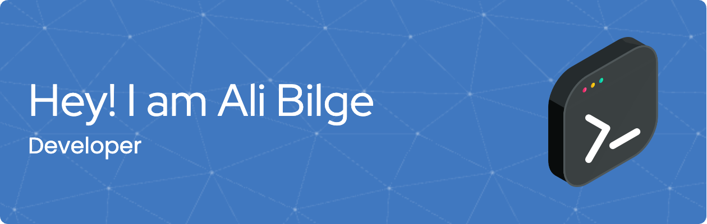

    
    &nbsp;&nbsp;&nbsp;&nbsp;&nbsp;&nbsp;&nbsp;&nbsp;
    
    &nbsp;&nbsp;&nbsp;&nbsp;&nbsp;&nbsp;&nbsp;&nbsp;
     
    &nbsp;&nbsp;&nbsp;&nbsp;&nbsp;&nbsp;&nbsp;&nbsp;

  
I'm a passionate Computer Engineering student at Dokuz Eylul University with a keen interest in software development, data science, and artificial intelligence. As the Lead of Google Developer Student Clubs (GDSC) at my university, I thrive on fostering innovation and building a vibrant tech community.

## My favorite tools and technologies ⚙️

> Tools and technologies that I have worked with and am interested in

<table>
  <tr>
    <td align="center" width="96">
      
       Python
    </td>
    <td align="center" width="96">
        
       Javascript
    </td>
       <td align="center" width="96">
        
       Github
    </td>
    <td align="center" width="96">
        
       Git
    </td>
    <td align="center"  width="96">
        
       HTML
    </td>
    <td align="center" width="96">
        
       CSS
    </td>
        <td align="center" width="96">
        
       PostgreSQL
    </td>
    <td align="center" width="96">
        
       Dart
    </td>

  </tr>
 <tr>
 </tr>
</table>

## Github stats 📊

  
GitHub Profile Stats 💻

   
    
  
   

  
Activity Graph 📈

   

  
Profile Views 👁️

   
  

## GitHub Profile Trophy 🏆

<!--
**alibilgealtun/alibilgealtun** is a ✨ _special_ ✨ repository because its `README.md` (this file) appears on your GitHub profile.

Here are some ideas to get you started:

- 🔭 I’m currently working on ...
- 🌱 I’m currently learning ...
- 👯 I’m looking to collaborate on ...
- 🤔 I’m looking for help with ...
- 💬 Ask me about ...
- 📫 How to reach me: ...
- 😄 Pronouns: ...
- ⚡ Fun fact: ...
-->

